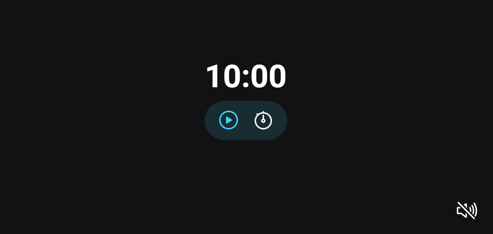

<h1 align="center"> FocusTimer - Pomodoro </h1>

> [Technologies](#technologies)

> [Project](#project)

> [How to Use](#how-to-use)

> [Files](#files)

> [License](#license)

> [README in Portuguese](#readme-in-portuguese)

  

 

  

## Technologies

- HTML
- CSS
- JavaScript
- Git and GitHub
- Figma

## Project

This is a JavaScript project that implements a timer with controls, sounds, and events. The application was designed to be simple and easy to use.

## How to Use

To access the finished project, [click here](https://fernandoalvesrufino.github.io/focus-timer/).

## Files

The project is composed of the following files:

- `Controls`: this module manages the buttons that control the timer, such as play, pause, stop, and set. It receives an object with references to the HTML buttons and returns an object with methods to control the buttons.

- `Timer`: this module manages the countdown timer and displays the remaining time on the screen. It receives references to the HTML elements that display the minutes and seconds and a function to reset the control buttons.

- `Sound`: this module plays sounds at different times during the timer, such as when it starts, stops, or finishes. The sound can be turned on or off depending on the user's preference.

- `Events`: this module sets up event listeners for the control buttons and the timer and manages the interactions between the other modules. It ensures that the timer and controls work together seamlessly, providing a smooth user experience.

## License
This project is under the MIT license.

---

by Fernando Rufino

`Project created by Rocketseat`

# README in portuguese

<h1 align="center"> FocusTimer - Pomodoro </h1>

> [Tecnologias](#tecnologias)

> [Projeto](#projeto)

> [Como Usar](#como-usar)

> [Arquivos](#arquivos)

> [Licença](#licença)

  

 

  

## Tecnologias

- HTML
- CSS
- JavaScript
- Git e GitHub
- Figma

## Projeto

Este é um projeto em JavaScript que implementa um temporizador com controles, sons e eventos. O aplicativo foi projetado para ser simples e fácil de usar.

## Como Usar

- Para acessar ao projeto finalizado, [clique aqui](https://fernandoalvesrufino.github.io/focus-timer/).

## Arquivos

O projeto é composto pelos seguintes arquivos:

- `Controls`: este módulo gerencia os botões que controlam o temporizador, como tocar, pausar, parar e definir. Ele recebe um objeto com referências aos botões HTML e retorna um objeto com métodos para controlar os botões.

- `Timer`: este módulo gerencia o temporizador de contagem regressiva e exibe o tempo restante na tela. Ele recebe referências aos elementos HTML que exibem os minutos e segundos e uma função para redefinir os botões de controle.

- `Sound`: este módulo reproduz sons em diferentes momentos durante o temporizador, como quando ele começa, para ou termina. O som pode ser ligado ou desligado dependendo da preferência do usuário.

- `Events`: este módulo configura os ouvintes de eventos para os botões de controle e o temporizador e gerencia as interações entre os outros módulos. Ele garante que o temporizador e os controles trabalhem juntos perfeitamente, proporcionando uma experiência de usuário suave.

## Licença

Esse projeto está sob a licença MIT.

---

by Fernando Rufino

`Projeto criado pela Rocketseat`